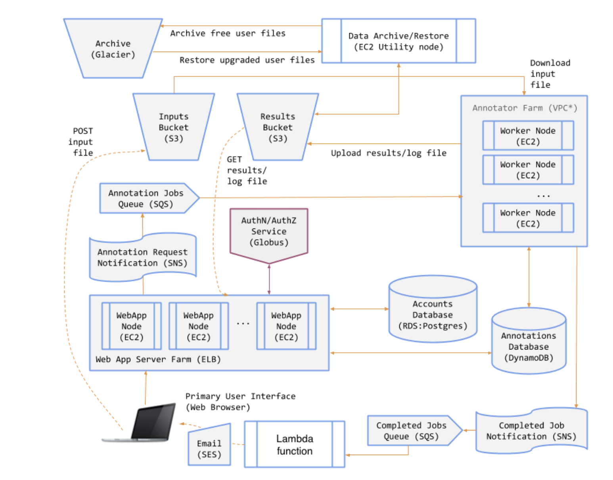

### A Genomics Annotation Service

This is a cloud computing project where I built a SaaS for a genomics annotation service (short as 'GAS'). Users can log in on the website (now discarded because the aws resources are only purchased during the Cloud Computing course from University of Chicago, which this project is originated from), submit genomics related files for annotation, and download the result files once the annotation is completed. Glacier is utilized for result files to archive if the user is not a premium user, and the users can upgrade and downgrade to and from premium users according their needs. In the very end, the project is realized in a distributed system manner and uses a load balancer that allows scaling up and down based on the ongoing annotation workload. The main tool being used is Flask and Boto3. The cloud resource provider is AWS.

The image below describes the GAS framework and the source codes are also provided for public view.

